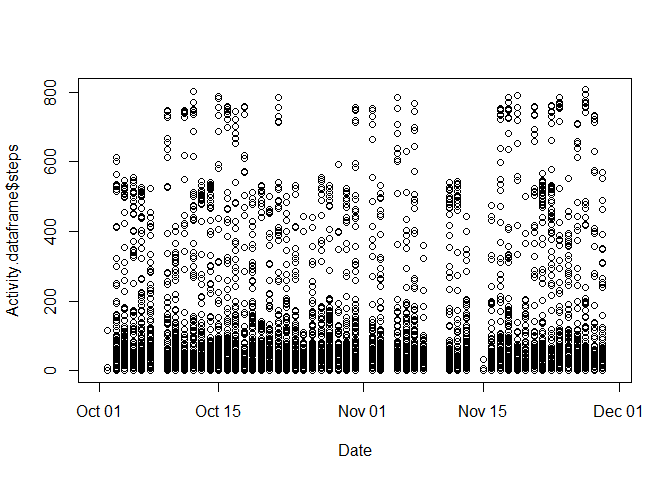
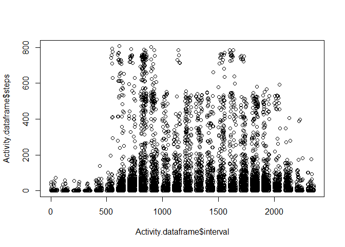
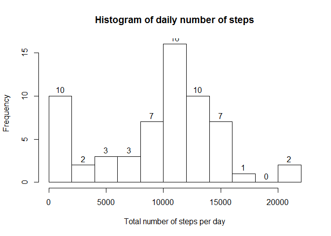
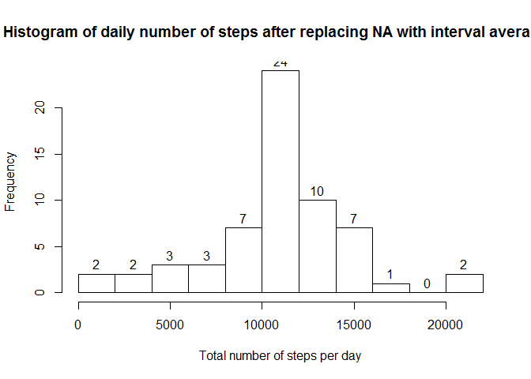
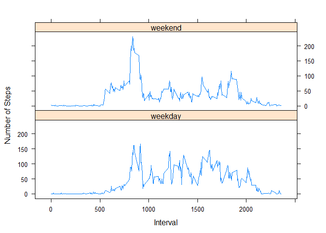

# Reproducible Research: Peer Assessment 1


## Loading and preprocessing the data


```r
Activity.rawdata <- read.csv('activity.csv')
# summary of raw data
summary(Activity.rawdata)
```

```
##      steps                date          interval     
##  Min.   :  0.00   2012-10-01:  288   Min.   :   0.0  
##  1st Qu.:  0.00   2012-10-02:  288   1st Qu.: 588.8  
##  Median :  0.00   2012-10-03:  288   Median :1177.5  
##  Mean   : 37.38   2012-10-04:  288   Mean   :1177.5  
##  3rd Qu.: 12.00   2012-10-05:  288   3rd Qu.:1766.2  
##  Max.   :806.00   2012-10-06:  288   Max.   :2355.0  
##  NA's   :2304     (Other)   :15840
```

```r
# transform to data frame
Activity.dataframe = data.frame(Activity.rawdata)
str(Activity.dataframe)
```

```
## 'data.frame':	17568 obs. of  3 variables:
##  $ steps   : int  NA NA NA NA NA NA NA NA NA NA ...
##  $ date    : Factor w/ 61 levels "2012-10-01","2012-10-02",..: 1 1 1 1 1 1 1 1 1 1 ...
##  $ interval: int  0 5 10 15 20 25 30 35 40 45 ...
```

```r
# exploratory plots of original data
Date <- as.Date(Activity.dataframe$date)
plot(Date,Activity.dataframe$steps)
```

 

```r
plot(Activity.dataframe$interval,Activity.dataframe$steps)
```

 

## What is mean total number of steps taken per day?

```r
library(dplyr)
```

```
## Warning: package 'dplyr' was built under R version 3.1.3
```

```
## 
## Attaching package: 'dplyr'
## 
## The following object is masked from 'package:stats':
## 
##     filter
## 
## The following objects are masked from 'package:base':
## 
##     intersect, setdiff, setequal, union
```

```r
by_date <- group_by(Activity.dataframe, date)
total_steps_by_date <- summarize(by_date, total_steps = sum(steps, na.rm = TRUE))
hist(total_steps_by_date$total_steps, breaks = 15, 
     labels = TRUE, main = "Histogram of daily number of steps", xlab = 'Total number of steps per day')
```

 


```r
Mean_total <- mean(total_steps_by_date$total_steps)
Median_total <- median(total_steps_by_date$total_steps)
noquote(sprintf("Mean total number of steps per day is %.1f", Mean_total))
```

```
## [1] Mean total number of steps per day is 9354.2
```

```r
noquote(sprintf("Median total number of steps per day is %.1f", Median_total))
```

```
## [1] Median total number of steps per day is 10395.0
```

## What is the average daily activity pattern?

```r
by_interval <- group_by(Activity.dataframe, interval)
daily_pattern <- summarize(by_interval, average_steps = mean(steps, na.rm = TRUE))
Daily_peak <- daily_pattern$interval[which.max(daily_pattern$average_steps)]
noquote(sprintf("Peak of daily activity is observed at %.0f", Daily_peak))
```

```
## [1] Peak of daily activity is observed at 835
```


## Imputing missing values

```r
CheckNA <- complete.cases(Activity.dataframe)
noquote(sprintf("There are %f missing values", sum(!CheckNA)))
```

```
## [1] There are 2304.000000 missing values
```

```r
# will replace the missing values with the mean values for specific intervals
Activity.imput <- Activity.dataframe
Unique.Intervals <- unique(Activity.imput$interval)
for (i in 1:length(Unique.Intervals)) {
  I_to_replace <- which(is.na(Activity.imput$steps) & (Activity.imput$interval == Unique.Intervals[i]))
  Activity.imput$steps[I_to_replace] <- daily_pattern$average_steps[i]
  }
by_date_imput <- group_by(Activity.imput, date)
total_steps_by_date_imput <- summarize(by_date_imput, total_steps = sum(steps, na.rm = TRUE))
hist(total_steps_by_date_imput$total_steps, breaks = 15, 
     labels = TRUE, main = "Histogram of daily number of steps after replacing NA with interval averages", 
     xlab = 'Total number of steps per day')
```

 

```r
Mean_total_imput <- mean(total_steps_by_date_imput$total_steps)
Median_total_imput <- median(total_steps_by_date_imput$total_steps)
noquote(sprintf("Mean total number of steps per day, after replacing NA with interval averages is %.3f", Mean_total_imput))
```

```
## [1] Mean total number of steps per day, after replacing NA with interval averages is 10766.189
```

```r
noquote(sprintf("Median total number of steps per day, after replacing NA with interval averages is %.3f", Median_total_imput))
```

```
## [1] Median total number of steps per day, after replacing NA with interval averages is 10766.189
```

#### Replacing missing values with interval averages normalizes the observed sample distribution (with new mean and median, equal to each other)


## Are there differences in activity patterns between weekdays and weekends?

```r
WeekDay <- weekdays(as.Date(Activity.imput$date, format = "%Y-%m-%d"))
WeekDay[which(WeekDay == "Saturday")] <- 0;
WeekDay[which(WeekDay == "Sunday")] <- 0;
WeekDay[which(WeekDay != 0)] <- 1;
Activity.imput <- mutate(Activity.imput, WeekDay = factor(WeekDay, levels = c(0,1), labels = c("weekday","weekend")))
summary(Activity.imput)
```

```
##      steps                date          interval         WeekDay     
##  Min.   :  0.00   2012-10-01:  288   Min.   :   0.0   weekday: 4608  
##  1st Qu.:  0.00   2012-10-02:  288   1st Qu.: 588.8   weekend:12960  
##  Median :  0.00   2012-10-03:  288   Median :1177.5                  
##  Mean   : 37.38   2012-10-04:  288   Mean   :1177.5                  
##  3rd Qu.: 27.00   2012-10-05:  288   3rd Qu.:1766.2                  
##  Max.   :806.00   2012-10-06:  288   Max.   :2355.0                  
##                   (Other)   :15840
```

```r
by_interval_imput <- group_by(Activity.imput, interval, WeekDay)
daily_pattern_imput <- summarize(by_interval_imput, average_steps = mean(steps, na.rm = TRUE))

library(lattice) 
xyplot(average_steps ~ interval|WeekDay, data = daily_pattern_imput, layout = c(1,2), xlab = "Interval", ylab = "Number of Steps", type = "l")
```

 
